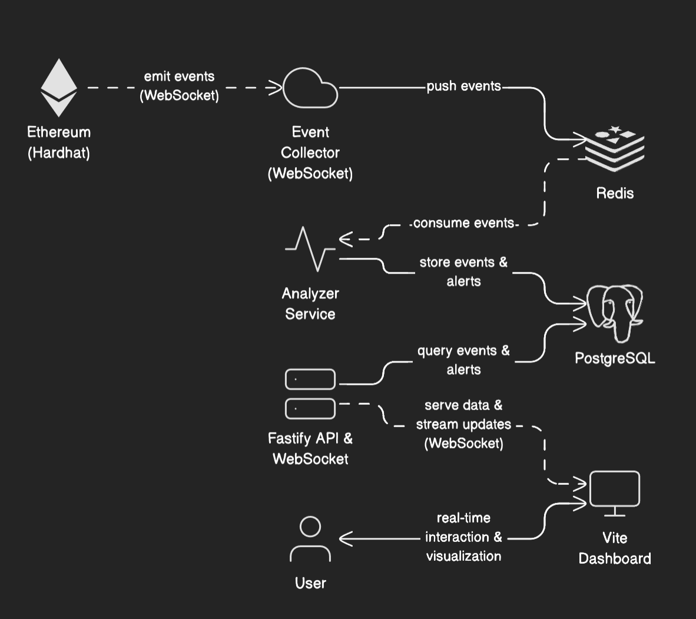

# Chainova  

## 1. Overview

**Chainova** is a blockchain security monitoring and analytics tool designed to detect suspicious and anomalous transaction behavior in near real time.  
The system observes blockchain events, processes them through analytical pipelines, persists them for forensic analysis, and visualizes detected threats through a web-based dashboard.

Unlike traditional static or signature-based scanners, Chainova focuses on **behavioral and statistical threat detection**, making it suitable for identifying spam attacks, transaction flooding, and coordinated activity

---

## 2. High-Level Architecture

Chainova follows a **modular, event-driven architecture**, implemented primarily in TypeScript.

Main components:

1. Smart Contract (Event Source)
2. Event Collector
3. Analyzer Worker
4. Database & Cache Layer
5. API & WebSocket Server
6. Web Dashboard (Vite-based)

Each component is loosely coupled, enabling scalability and independent evolution.

---

## 3. Workflow of the Tool

### 3.1 Smart Contract Event Generation

- A custom smart contract is deployed on an Ethereum-compatible blockchain using Hardhat.
- The contract emits structured security-related events for on-chain activities.
- These events act as raw telemetry for off-chain monitoring.

**Goal:**  
Provide reliable, tamper-resistant security signals directly from the blockchain.

---

### 3.2 Event Collection Layer

- The Event Collector connects to the blockchain via WebSocket.
- It continuously listens for emitted events.
- Each event is serialized and pushed to **Redis** for buffering.

**Why Redis is used:**
- High-throughput ingestion
- Acts as a message queue
- Decouples ingestion from analysis
- Handles traffic bursts without data loss

---

### 3.3 Event Analysis Pipeline

The Analyzer Worker consumes events from Redis and processes them in several stages:

#### a. Event Normalization
- Extracts sender, receiver, transaction value, timestamp, and metadata.
- Converts blockchain-specific formats into normalized records.

#### b. Persistent Storage
- All normalized events are stored in **PostgreSQL**.
- Enables historical analysis, replay, and forensic auditing.

#### c. Detection Logic Execution
- Rule-based detection
- Time-series anomaly detection
- Behavioral correlation analysis

---

### 3.4 Alert Generation

- When detection thresholds are exceeded:
  - Alerts are generated
  - Severity levels are assigned (`info`, `low`, `medium`, `high`, `critical`)
- Alerts are persisted and exposed via API and WebSocket streams.

---

### 3.5 API and Real-Time Streaming

- A Fastify-based API exposes:
  - Events
  - Alerts
  - Aggregated metrics
- A WebSocket channel streams alerts in real time to the dashboard.

---

### 3.6 Dashboard and Visualization Layer (Vite)

- The frontend dashboard is built using **Vite** and React.
- It consumes REST and WebSocket APIs.
- Charts and visualizations are also implemented 

**Dashboard Capabilities:**
- Real-time alert monitoring
- Historical event exploration
- Severity-based filtering
- Time-series anomaly visualization

---

## 4. Database Design and Structure

Chainova uses **PostgreSQL** for persistent storage and **Redis** for real-time processing.

---

## 4.1 Core Database Tables

### 4.1.1 `events` Table

Stores all blockchain events ingested by the system.

| Column Name       | Type        | Description |
|------------------|------------|-------------|
| `id`             | UUID / INT | Unique event identifier |
| `tx_hash`        | TEXT       | Blockchain transaction hash |
| `block_number`  | BIGINT     | Block number |
| `sender`         | TEXT       | Sender address |
| `receiver`       | TEXT       | Receiver address |
| `value`          | NUMERIC    | Transaction value |
| `event_type`     | TEXT       | Event category |
| `timestamp`      | TIMESTAMP  | Blockchain timestamp |
| `created_at`     | TIMESTAMP  | Insert time |

**Purpose:**  
Acts as the immutable source of truth for all observed blockchain activity.

---

### 4.1.2 `alerts` Table

Stores detected security alerts.

| Column Name    | Type        | Description |
|---------------|------------|-------------|
| `id`          | UUID / INT | Alert identifier |
| `event_id`    | UUID / INT | Related event |
| `severity`    | TEXT       | Alert severity |
| `rule_name`   | TEXT       | Triggered rule |
| `description` | TEXT       | Explanation |
| `created_at`  | TIMESTAMP  | Creation time |

**Purpose:**  
Separates raw telemetry from actionable security findings.

---

### 4.1.3 Derived / Analytical Structures

Time-series and aggregated statistics are derived from base tables and cached when needed.

| Element | Description |
|-------|-------------|
| Sliding windows | Transaction rate analysis |
| Aggregations | Per-sender / per-receiver stats |
| Histograms | Value and frequency distributions |

---

## 4.2 Redis Structures

Redis is used exclusively for **real-time and short-lived data**.

| Redis Element | Usage |
|--------------|-------|
| Lists / Streams | Event ingestion queue |
| Hashes | Temporary counters |
| TTL keys | Sliding window detection |

---

## 5. Threat Monitoring Techniques Used

Chainova applies a layered threat detection strategy.

---

### 5.1 Rule-Based Detection

Detects known malicious patterns such as:

- Transaction spam bursts
- One-to-many receiver spraying
- Repeated abnormal sender activity
- Coordinated account behavior

**Strengths:**
- Deterministic
- Explainable
- Low computational cost

---

### 5.2 Time-Series Anomaly Detection

Statistical methods detect deviations from normal behavior.

#### a. Z-Score Analysis
- Detects sudden spikes in transaction volume or value

#### b. EWMA (Exponentially Weighted Moving Average)
- Detects gradual and sustained behavioral changes

---

### 5.3 Behavioral Correlation Analysis

- Correlates sender, receiver, frequency, and value
- Identifies distributed and coordinated attacks
- Useful for detecting bot-like activity

---

### 5.4 Optional AI-Assisted Analysis

- AI is used as an **auxiliary layer**
- Provides contextual summaries and explanations
- Does not replace deterministic detection logic

---

## 6. Security and Design Principles

- **Defense in Depth**
- **Fail-Safe Defaults**
- **Auditability**
- **Scalability**
- **Explainability**

---

